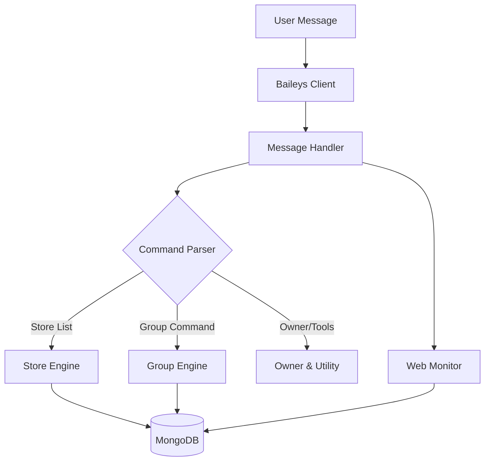

<!-- Wave Header -->

_🌸 Fusionify_  
**FTV BOT — Store-First WhatsApp Bot (Premium)**  
_Store List dulu, baru grup jadi rapih._ (≧◡≦) ♡

  
  
  
  

  Built on Baileys • Written in JavaScript • Designed for store sellers & admins
   
  
    <a href="#-overview">Overview</a> •
    <a href="#-paket--harga">Harga</a> •
    <a href="#-store-list-fokus-utama">Store List</a> •
    <a href="#-highlight-command-asli-dari-bot">Commands</a> •
    <a href="#-order--kerja-sama">Order</a>
  

## 🚀 Overview

Fusionify BOT adalah bot WhatsApp premium yang fokusnya jelas: **STORE LIST dulu**, lalu manajemen grup, dan monitoring.

<table>
  <tr>
    <td align="center" width="33%">
      
       
      <b>Store List</b> 
      keyword auto-reply 
      status order + feedback 
      open / close
    </td>
    <td align="center" width="33%">
      
       
      <b>Group Management</b> 
      anti suite 
      welcome & rules 
      admin tools
    </td>
    <td align="center" width="33%">
      
       
      <b>Web Monitor</b> 
      realtime stats 
      logs + sewa list 
      command usage
    </td>
  </tr>
</table>

## 💎 Paket & Harga

<table>
  <tr>
    <th align="left">Paket</th>
    <th align="left">Harga</th>
  </tr>
  <tr>
    <td><b>Sewa Bot</b> (per grup)</td>
    <td><b>7K / bulan</b></td>
  </tr>
  <tr>
    <td><b>Source Code (SC)</b></td>
    <td><b>180K</b> (sekali bayar)</td>
  </tr>
</table>

## 🛍️ Store List (Fokus Utama)
<table>
  <tr>
    <td align="center" width="33%">
      <b>📋 List Produk</b> 
      Auto-reply keyword 
      Support gambar 
      Anti typo (smart match)
    </td>
    <td align="center" width="33%">
      <b>🧾 Status Order</b> 
      proses / done 
      batal / refund 
      feedback per item
    </td>
    <td align="center" width="33%">
      <b>💳 Store Tools</b> 
      payment (QRIS/e-wallet) 
      struk + PDF 
      testimonial
    </td>
  </tr>
</table>

## 🛡️ Manajemen Grup
<table>
  <tr>
    <td align="center" width="33%">
      <b>🚫 Anti Suite</b> 
      antilink, antiforward 
      antispam, antidelete 
      antivirtex, antitoxic
    </td>
    <td align="center" width="33%">
      <b>👋 Welcome & Rules</b> 
      welcome, left 
      rules management 
      mute/restrict
    </td>
    <td align="center" width="33%">
      <b>🧰 Admin Tools</b> 
      hidetag, pin, poll 
      kick/add/promote 
      votekick
    </td>
  </tr>
</table>

## 🏗️ Architecture (High-level)

## 🧩 Highlight Command (Asli dari Bot)

<b>Klik untuk lihat daftar command</b> (≧◡≦) ♡

 

**Store List**
- `list`, `addlist`, `updatelist`, `dellist`, `dellistno`, `viewlist`, `previewlist`
- `proses` / `p`, `done` / `d`, `batal` / `b`, `refund` / `r`
- `feedback`, `storestats` / `stats`, `open`, `close`

**Payment**
- `paymentdl`, `setpayment`, `updatepayment`, `delpayment`

**Struk**
- `struk`, `laporadmin`, `getpdf`

**Testimonial**
- `testi`, `addtesti`, `deltesti`, `settesti`, `exporttesti`, `importtesti`

**Grup**
- `antilink`, `antiforward`, `antispam`, `antidelete`, `antivirtex`, `antitoxic`, `antiviewonce`, `antimedia`, `antiforeign`
- `welcome`, `rules`, `mute`, `hidetag`, `kick`, `add`, `promote`, `demote`, `pin`, `poll`, `votekick`

**Sewa (Owner)**
- `addsewa`, `renewsewa`, `ceksewa`, `listsewa`, `cekexpired`, `delsewa`

## 📩 Order / Kerja Sama

**Minat sewa / beli SC? Yuk chat sekarang~** (｡•̀ᴗ-)✧

 
Fast response • Bisa tanya dulu kok • Jangan malu~ (≧◡≦) ♡

## 🔒 Lisensi & Distribusi
Repo ini adalah **halaman publik** untuk informasi & showcase.  
Kode/SC tetap **private** dan hanya dibagikan via jalur resmi.
- Dilarang re-upload / re-sell / claim ownership tanpa izin
- Dilarang membagikan file SC ke publik

  

